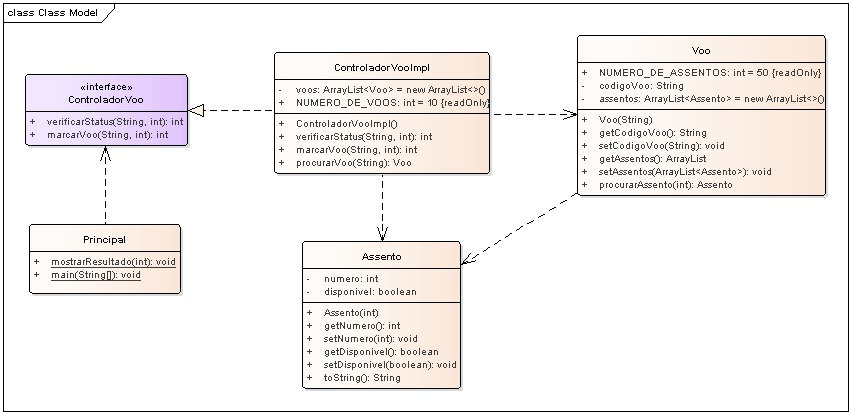

# Aplicação Java Sistema de Controle de Passagem.

## Contextualização

Sistema de Controle de Passagem que realiza a consulta e marcação de voo e assento desenvolvido em Java.
O programa controla e mantêm os voos e assentos. 

### Consulta Voo

Para o programa consultar é necessário chamar o método "verificarStatus" do objeto do ControleVoo. 
Na consulta o programa especifica um voo e assento para saber se estão disponíveis através do método. 

O método do objeto remoto do servidor retorna:
 - 0: voo disponível
 - 1: assento indisponível
 - 2: assento inexistente
 - 3: voo inexistente
 - 4: marcação realizada

Todos os códigos dos voos se iniciam com a letra "A":
 - **"A1"**

### Marcação Voo

A marcação envolve chamar o método "marcarVoo" e enviar o código do voo e assento e este marcar como indisponível. 

O programa servidor retorna:
 - 0: voo disponível
 - 1: assento indisponível
 - 2: assento inexistente
 - 3: voo inexistente
 - 4: marcação realizada

## Diagrama de classes

## Arquivo do projeto

O arquivo Modelo.EAP é o projeto do sistema utilizando ferramanta CASE Enterprise Arquitect.

## Outros arquivos

- pom.xml - Arquivo de configuração da ferramenta de automação Maven.
- *.bat - Arquivos de lote(Batch) de console para tarefas compilar, executar, documentar, empacotar e limpar o projeto.